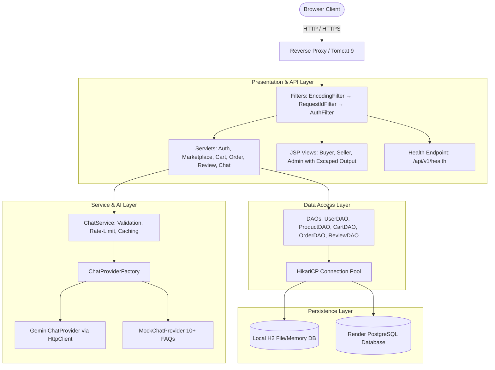

# RashikMart

> **Anna University R2025 Sem 3 Java Capstone Project**  
> Package: `com.rashik.rashikmart`  
> Live Deployment: [<LIVE_URL>](https://rashikmart.onrender.com) *(Placeholder for cloud deployment URL)*

[](https://github.com/Rashik787708/RashikMart/actions)

-orange)


---

## 1. Problem Statement & Overview

Traditional e-commerce platforms often impose heavy middleware stacks, proprietary dependencies, and opaque operational overhead. **RashikMart** is a high-performance, lightweight multi-vendor agricultural and consumer goods marketplace designed and built strictly according to the Anna University R2025 Semester 3 Java Capstone specifications.

The application delivers end-to-end e-commerce capabilities:
- **Role-Based Access Control (RBAC):** Distinct workflows for `BUYER`, `SELLER`, and `ADMIN` users.
- **Product & Inventory Management:** Sellers list, edit, image-upload, and safely deactivate or delete products.
- **Transactional Shopping Cart & Checkout:** Atomic checkout deducting stock with zero overselling, multi-vendor order generation, and mock payment verification.
- **Order Lifecycle Management (O2):** Strict state machine advancing orders: `PENDING` &rarr; `CONFIRMED` &rarr; `SHIPPED` &rarr; `DELIVERED`, with 409 Conflict protection against illegal transitions.
- **Verified Buyer Reviews (F8):** Product rating (1–5 stars) and review submission unlocked strictly for buyers who hold a `DELIVERED` order for the item.
- **AI Shopping Assistant (O4):** Conversational AI chatbot powered by Google Gemini (defaulting to free-tier `gemini-3.1-flash-lite`) with automatic failover to an offline deterministic FAQ provider, per-session rate limiting, and in-memory caching.
- **Enterprise Hygiene:** PreparedStatements exclusively, CSRF token validation on all state-changing operations, XSS escaping, request correlation IDs (`X-Request-Id`), SLF4J/Logback structured logging, and dual database support (embedded H2 locally, PostgreSQL on Render).

---

## 2. High-Level Architecture



---

## 3. Technology Stack

| Component | Technology | Version / Details |
|---|---|---|
| **Language** | Java (JDK) | OpenJDK 17 LTS |
| **Web Container** | Apache Tomcat | 9.0 (`javax.servlet-api` 4.0.1) |
| **Build Tool** | Apache Maven | 3.9+ (`pom.xml`) |
| **Connection Pool** | HikariCP | 5.1.0 |
| **Local Database** | H2 Database | 2.3.232 (embedded, file & memory) |
| **Production DB** | PostgreSQL Driver | 42.7.3 (Render hosted) |
| **Security / Hash** | jBCrypt | 0.4 (Blowfish crypt salted hashing) |
| **JSON Parser** | Google Gson | 2.11.0 |
| **Logging** | SLF4J + Logback | 2.0.16 + 1.5.8 (MDC `%X{requestId}`) |
| **Testing** | JUnit 5 & Vintage + Mockito | Jupiter 5.10.3 + Mockito 4.11.0 |
| **AI Integration** | Google Gemini REST API | `gemini-3.1-flash-lite` with Mock fallback |

---

## 4. Setup & Installation

### Prerequisites
- Java Development Kit (JDK) 17 or higher (`java -version`)
- Apache Maven 3.8+ (`mvn -v`)
- Git

### Local Development (Zero Database Setup Required)
RashikMart automatically creates and bootstraps an embedded H2 database under `./data/rashikmart.mv.db` with seeded catalog items on first startup.

1. **Clone the repository:**
   ```bash
   git clone https://github.com/Rashik787708/RashikMart.git
   cd RashikMart
   ```

2. **Run tests and package WAR:**
   ```bash
   mvn clean verify
   ```
   *(All 159 test cases will execute against an isolated in-memory test database)*.

3. **Run with Tomcat or Docker:**
   - **Tomcat 9:** Deploy `target/RashikMart.war` into Tomcat `webapps/`.
   - **Docker:**
     ```bash
     docker build -t rashikmart .
     docker run -p 8080:8080 rashikmart
     ```
   - Open browser at `http://localhost:8080/RashikMart` (or `http://localhost:8080`).

---

## 5. Environment Variables

Configure application settings via environment variables (or container settings). See [`.env.example`](.env.example) for documentation.

| Variable | Default (Local) | Production (Render) | Description |
|---|---|---|---|
| `DB_TYPE` | `h2` | `postgres` | Persistence engine selection |
| `DB_URL` | `jdbc:h2:./data/rashikmart` | *(unused)* | Local H2 JDBC connection string |
| `DATABASE_URL` | *(blank)* | `postgresql://...` | Render PostgreSQL pooled connection URL |
| `ADMIN_PASSWORD` | `admin123` | *(secure password)* | Seeded Administrator account password |
| `AI_CHATBOT_PROVIDER` | `mock` | `mock` or `gemini` | Chatbot provider strategy |
| `GEMINI_API_KEY` | *(blank)* | *(your API key)* | Google Gemini API key (server-side only) |
| `GEMINI_MODEL` | `gemini-3.1-flash-lite` | `gemini-3.1-flash-lite` | Target Gemini model name |
| `RASHIKMART_UPLOAD_DIR` | `./data/product-images` | `/var/data/uploads` | Persistent directory for seller photos |

---

## 6. Architecture & System Diagrams

The system design diagrams are maintained in [`docs/diagrams/`](docs/diagrams/):
- **[D1: Entity-Relationship (ER) Diagram](docs/diagrams/D1_ER_Diagram.mmd)** — Schema entities (`users`, `products`, `cart`, `cart_items`, `orders`, `order_items`, `reviews`).
- **[D2: Use-Case Diagram](docs/diagrams/D2_UseCase_Diagram.mmd)** — Actor workflows for `BUYER`, `SELLER`, `ADMIN`, and `GUEST` (F1–F8 + AI Chatbot).
- **[D3: Place-Order Sequence Diagram](docs/diagrams/D3_PlaceOrder_Sequence_Diagram.mmd)** — Transactional checkout execution path across Servlets, DAOs, and the database.

---

## 7. Screenshots & UI Gallery

Placeholders located in `docs/screenshots/`:
- **Marketplace Browse & Filter:** Search by keyword, price range, and category with real-time stock counters.
- **Transactional Cart & Checkout:** Item quantity adjustments and instant mock checkout.
- **Seller Management Dashboard:** Add/edit products, stock status toggles, image upload preview.
- **Order Lifecycle Badges:** Color-coded order tracking (`PENDING`, `CONFIRMED`, `SHIPPED`, `DELIVERED`).
- **Floating AI Chatbot Widget:** Non-intrusive floating assistant answering customer questions in real time.

---

## 8. Demo Accounts

For grading and demonstration, demo accounts are created automatically upon startup:

| Role | Email | Password Reference | Access Scope |
|---|---|---|---|
| **Administrator** | `admin@rashikmart.com` | Configured via `ADMIN_PASSWORD` (default `admin123`) | Product moderation, platform revenue & order metrics |
| **Demo Seller** | `seller@rashikmart.com` | `seller123` | Product catalog CRUD, image uploads, shipping orders |
| **Demo Buyer** | `buyer@rashikmart.com` | `buyer123` | Browse catalog, add to cart, checkout, review delivered items |

---

## 9. Testing & Quality Assurance

RashikMart features a comprehensive automated test suite consisting of **159 test cases**:
```bash
# Run all automated tests
mvn test

# Run full build with WAR packaging
mvn -B clean verify
```

Key test suites:
- `RashikMartFlowTest`: Full end-to-end multi-step integration flow (registration &rarr; catalog &rarr; stock deduction &rarr; isolation).
- `ChatServiceTest`, `MockChatProviderTest`, `ChatServletTest`: AI Chatbot input validation, rate limiting (10 msg/min), caching, and HTTP 429/403/400 codes.
- `OrderStatusServletTest`: Order state machine transitions and 409 Conflict rejection.
- `OrderDAOTest`: Transactional checkout, insufficient-stock rejection, and a concurrent no-oversell test (multiple buyers racing for limited stock).
- `ReviewDAOTest`: Delivered order prerequisite enforcement and duplicate prevention.
- `UploadUtilTest`, `EditProductServletTest`: SVG upload rejection and server-authoritative image URLs (stored-XSS defence).
- `DeleteProductServletTest`: Ownership isolation and open-redirect rejection on the `redirect` parameter.
- `AuthFilterTest`, `SecurityTest`: Role-based route guards, SQL-injection payloads, BCrypt strength, and CSRF validation.

---

## 10. Security Notes

| Area | Control |
|---|---|
| Password storage | BCrypt (Blowfish) salted hashing, cost factor 12; plaintext is never stored or compared. |
| SQL injection | Every query uses `PreparedStatement` with bound parameters; no string concatenation of user input. |
| Output encoding | All user-controlled output is passed through `HtmlUtil.escape` in JSPs. |
| CSRF | Per-session random token validated (constant-time) on every state-changing POST, including multipart forms. |
| Session fixation | `request.changeSessionId()` is called on successful login before session attributes are set. |
| Authorization / IDOR | Orders, seller catalogs and order-status updates are scoped to the owning `buyer_id` / `seller_id`; buyer/seller/admin routes are role-guarded by `AuthFilter`. |
| Overselling | Checkout runs in a single transaction and deducts stock with an atomic `WHERE quantity >= ?` guard, so concurrent checkouts can never sell the same units twice or go negative. |
| Uploaded files | Only `.jpg/.jpeg/.png/.webp` are accepted (`.svg` rejected to prevent stored XSS); images are served with `X-Content-Type-Options: nosniff` and a restrictive `Content-Security-Policy`. |
| File paths | Upload/path handling resolves and verifies canonical paths to block traversal; the stored image URL is always read back from the database, never trusted from the browser. |
| Redirects | Post-action redirects are restricted to an allow-list of internal pages. |
| Secrets | DB URL, Gemini API key and admin password come from environment variables; local DB files, logs and IDE config are git-ignored. |

> **Demo admin account:** The local administrator password defaults to the documented `ADMIN_PASSWORD` fallback so first-run grading works out of the box. For any real deployment, set `ADMIN_PASSWORD` to a strong unique value (and preferably change it after first login). See [`.env.example`](.env.example).

---

## 11. License & Credits

Developed by **Rashik** for the Anna University R2025 Semester 3 Java Capstone Project.
All rights reserved © 2026.
