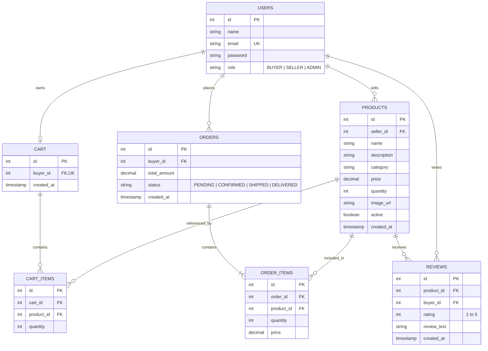
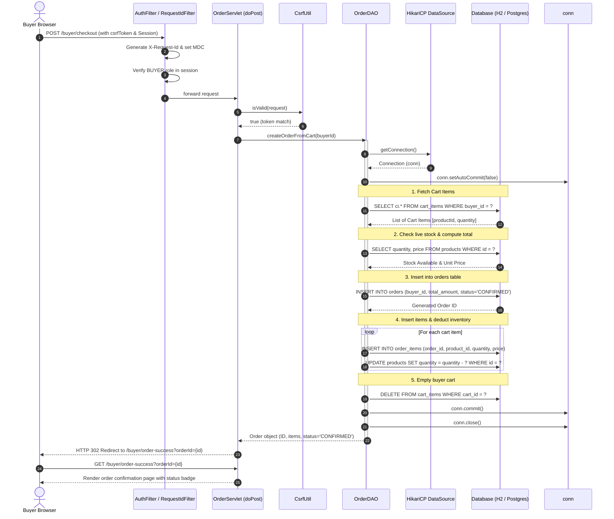

# RashikMart System Diagrams

This directory contains the authoritative architecture, data model, and behavioral diagrams for the RashikMart capstone application, rendered in Mermaid markdown format.

---

## D1: Entity-Relationship (ER) Diagram

File: [`D1_ER_Diagram.mmd`](D1_ER_Diagram.mmd)

---

## D2: Use-Case Diagram

File: [`D2_UseCase_Diagram.mmd`](D2_UseCase_Diagram.mmd)

```mermaid
flowchart TD
    Guest(["Guest Visitor"])
    Buyer(["Registered Buyer"])
    Seller(["Registered Seller"])
    Admin(["System Administrator"])

    subgraph UC_Public["Public / Guest Services"]
        UC_Reg["Register Account (Buyer/Seller)"]
        UC_Login["Login & Authenticate (BCrypt)"]
        UC_BrowsePublic["Browse Public Catalog"]
        UC_ChatGuest["Ask AI Chatbot (FAQ / Shopping Assistant)"]
    end

    subgraph UC_Buyer["Buyer Operations (F1, F4, F5, F6, F8)"]
        UC_BrowseMarket["Browse & Search Marketplace"]
        UC_ManageCart["Manage Cart (Add, Update, Remove)"]
        UC_Checkout["Checkout & Place Order (Mock Payment)"]
        UC_TrackOrders["View Order History & Status Badges"]
        UC_Review["Submit Review (Delivered Orders Only)"]
    end

    subgraph UC_Seller["Seller Operations (F2, F3, F7, O2)"]
        UC_AddProd["Add Product with Photo Upload"]
        UC_EditProd["Edit Product & Stock Level"]
        UC_DeleteProd["Safe Product Delete / Deactivation"]
        UC_SellerOrders["View Incoming Customer Orders"]
        UC_AdvanceOrder["Advance Order Status (Confirmed &rarr; Shipped &rarr; Delivered)"]
    end

    subgraph UC_Admin["Admin Operations (F7, Moderation)"]
        UC_ModProd["Moderate Products (Toggle Active Status)"]
        UC_AdminMetrics["View Platform Total Revenue & Orders"]
        UC_AdminOrders["View All Orders & Update Status"]
    end

    Guest --> UC_Reg
    Guest --> UC_Login
    Guest --> UC_BrowsePublic
    Guest --> UC_ChatGuest

    Buyer --> UC_BrowseMarket
    Buyer --> UC_ManageCart
    Buyer --> UC_Checkout
    Buyer --> UC_TrackOrders
    Buyer --> UC_Review
    Buyer --> UC_ChatGuest

    Seller --> UC_AddProd
    Seller --> UC_EditProd
    Seller --> UC_DeleteProd
    Seller --> UC_SellerOrders
    Seller --> UC_AdvanceOrder

    Admin --> UC_ModProd
    Admin --> UC_AdminMetrics
    Admin --> UC_AdminOrders
```

---

## D3: Place-Order Sequence Diagram

File: [`D3_PlaceOrder_Sequence_Diagram.mmd`](D3_PlaceOrder_Sequence_Diagram.mmd)

